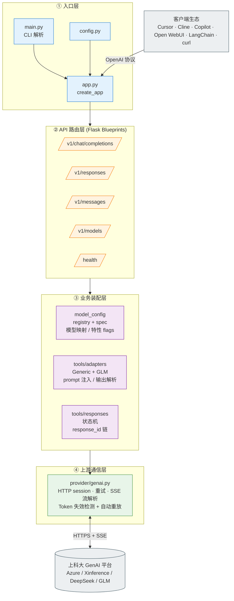
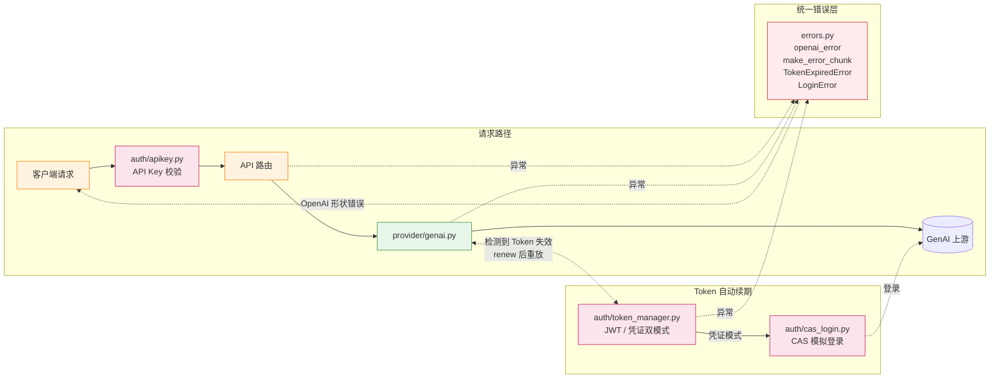
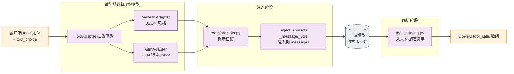

# GenAI2OpenAI

OpenAI 兼容的代理服务，将上海科技大学 GenAI 平台的 API 转换为标准 OpenAI 接口。

## 特性

- **OpenAI 兼容接口** — 直接对接任何支持 OpenAI API 的客户端（ChatGPT UI、Cursor、Continue 等），同时支持 Chat Completions (`/v1/chat/completions`) 和 Responses (`/v1/responses`) 两套 API
- **Anthropic / Claude 兼容接口** — 支持 `POST /v1/messages`、`POST /v1/messages/count_tokens`，可直接对接 Anthropic SDK / Claude 类客户端
- **Tool Calling** — 通过 prompt 注入实现 OpenAI 格式的 function calling，兼容不原生支持的模型
- **模型特化适配器架构** — `GenericAdapter`（JSON 格式）和 `GlmAdapter`（GLM 格式）自动按模型选择
- **tool_choice 支持** — `auto` / `required` / `none` / 指定函数名，通过 prompt 注入实现
- **流式 / 非流式** — 同时支持 SSE 流式和一次性返回两种模式
- **推理链 (Reasoning)** — 支持 DeepSeek、o3 等模型的 `reasoning_content` 输出
- **视觉 / 多模态 (Vision)** — 支持图片输入透传，同时兼容 Chat Completions 和 Responses 两套 API 的图片格式（已验证 Chatbox客户端）
- **Responses API** — 完整实现 OpenAI 新版 Responses API，含 `previous_response_id` 状态链接、`function_call_output` 回传、`store` / `retrieve` / `cancel` 操作；流式输出补齐 `response.content_part.*`、`response.completed`、`response.failed`
- **用户模型映射** — 可通过 `--config` / `CONFIG` 提供 `{"mapping":{"public-model":"genai-model"}}`，默认不自动添加别名
- **Token 智能识别** — `--token` 同时支持 JWT 字符串和 `学号@密码` 格式
- **自动登录与刷新** — 使用学号密码模式时，启动时自动通过 CAS 登录获取 JWT，过期时静默刷新，对客户端完全透明
- **动态模型列表** — 自动从 GenAI 平台拉取可用模型，无需硬编码
- **API Key 认证** — 可选的客户端认证，保护代理不被未授权访问

## 接入平台

### Copilot

> [!WARNING]
> 由于非 Insider 版本的 VSCode 不支持自定义端点，你需要
>
> - 要么切换到 VSCode Insider
> - 要么使用 [EnableCopilotCustomAI 插件](https://github.com/zqcli/enable-copilot-customoai/releases)，原帖[在此](https://linux.do/t/topic/2061692)

1. 打开控制面板，选择 `Chat: Open Language Models (JSON)`
2. 编辑并按如下格式输入/添加，注意模型能力需要对应：

```json
[
  {
    "name": "GenAI-localhost",
    "vendor": "customoai",
    "apiKey": "your-api-key",
    "models": [
    {
      "id": "deepseek-chat",
      "name": "DeepSeek-V4-Flash",
      "url": "http://localhost:5000/v1/chat/completions",
      "toolCalling": true,
      "vision": true,
      "maxInputTokens": 128000,
      "maxOutputTokens": 16000
    },
    {
      "id": "o3",
      "name": "ChatGPT-o3",
      "url": "http://localhost:5000/v1/chat/completions",
      "toolCalling": true,
      "vision": true,
      "maxInputTokens": 128000,
      "maxOutputTokens": 16000
    }
    ]
  },
]
```

### Codex CLI

> 以下以 CC Switch 为例

> [!WARNING]
> 注意，由于 Codex 只支持部分模型，因此我们支持使用 [Mapping 功能](#启动服务) 将某些模型映射到别的模型使用。

CC switch 中填入 `http://localhost:5000/v1` 即可，注意需要 `v1` 后缀

### Claude Code

同上，但是不需要 `v1` 后缀。

## Docker 部署

### 使用 Docker Compose（推荐）

```bash
# 使用学号密码
TOKEN="2024000001@mypassword" docker compose up -d

# 使用 JWT
TOKEN="eyJ..." docker compose up -d

# 自定义端口和 API Key
TOKEN="2024000001@mypassword" API_KEY="my-secret" PORT=8080 docker compose up -d
```

本地文件有两个：

- `docker-compose.local.yml`：本地构建
- `docker-compose.yml`：GitHub 预构建

### 使用 Docker

```bash
# 构建镜像
docker build -t genai2openai .

# 运行容器
docker run -d -p 5000:5000 genai2openai --token "2024000001@mypassword"

# 带 API Key
docker run -d -p 5000:5000 -e API_KEY="my-secret" genai2openai --token "2024000001@mypassword"
```

#### 使用预构建镜像

每次推送到 `main` 分支或创建版本标签时，GitHub Actions 会自动构建并推送镜像到 GitHub Container Registry：

```bash
docker pull ghcr.io/hebezang/genai2openai:main
docker run -d -p 5000:5000 ghcr.io/hebezang/genai2openai:main --token "2024000001@mypassword"
```

### 环境变量说明

| 变量      | 说明                                          | 默认值       |
| --------- | --------------------------------------------- | ------------ |
| `TOKEN`   | JWT 令牌或 `学号@密码`（docker-compose 必需） | —            |
| `API_KEY` | 客户端认证密钥                                | 无（不校验） |
| `PORT`    | 宿主机映射端口（仅 docker-compose）           | `5000`       |

## 安装与运行 (非 Docker)

### 环境要求

- Python 3.11+
- 推荐使用 [uv](https://github.com/astral-sh/uv) 管理环境

### 安装依赖

```bash
uv sync
```

`uv` 会自动创建并管理 `.venv`，后续统一用 `uv run` 执行命令。

### 启动服务

```bash
# 使用学号密码（推荐，支持自动刷新）
uv run main.py --token "2024000001@mypassword"

# 使用 JWT（需要手动更换过期 token）
uv run main.py --token "eyJ..."

# 完整参数
uv run main.py --token <token> [--port 5000] [--api-key <key>] [--debug]
```

用户自定义模型映射可通过 `--config` 传入，例如：

```bash
uv run main.py --token "..." --config '{"mapping":{"gpt-5-codex":"deepseek-pro"}}'
```

未传入 `--config` 时，不会自动添加任何模型别名。

也可以把环境变量放进 `.env`，然后这样启动：

```bash
uv run --env-file .env main.py --token "2024000001@mypassword"
```

| 参数        | 说明                                              | 默认值       |
| ----------- | ------------------------------------------------- | ------------ |
| `--token`   | JWT 令牌或 `学号@密码`（必需）                    | —            |
| `--port`    | 服务监听端口                                      | `5000`       |
| `--api-key` | 客户端认证密钥（也可通过 `API_KEY` 环境变量设置） | 无（不校验） |
| `--debug`   | 启用详细日志输出                                  | 关闭         |
| `--config`  | API 配置（Mapping 等）                            | 无（默认配置） |

## Token 模式

### 学号密码模式（推荐）

```bash
uv run main.py --token "2024134022@mypassword"
```

- 启动时通过上海科技大学统一身份认证 (CAS) 自动登录
- JWT 过期时自动重新登录获取新 token，对客户端完全透明
- 上游返回 401 时自动尝试刷新 token 并重试请求
- 密码错误时启动即报错退出，便于排查

### JWT 模式

```bash
uv run main.py --token "eyJ..."
```

- 直接使用已有的 JWT 令牌
- 过期后返回 401 错误，需要手动更换

**手动获取 JWT：**

1. 前往 [GenAI 对话平台](https://genai.shanghaitech.edu.cn/)
2. 打开浏览器开发者工具，发送一条消息，捕获 `chat` 请求
3. 复制请求头中的 `x-access-token` 字段


## 架构总览

整体采用**自顶向下的分层流水线**：客户端请求经入口装配后进入 API 路由层，路由依次调用模型注册中心、工具翻译层（侧挂）和上游通信层；认证模块作为纵向辅助通道，错误处理统一收口。

### 主调用链



### 横切关注点：认证 / 错误



### 工具调用翻译层（Function Calling 模拟）



## API 接口

### 聊天补全

```
POST /v1/chat/completions
```

支持流式和非流式模式，兼容 OpenAI Chat Completion API 格式。支持 `tools`、`tool_choice`、`max_tokens` 等参数。

### Responses

```
POST /v1/responses
GET  /v1/responses/<response_id>
POST /v1/responses/<response_id>/cancel
```

实现 OpenAI 新版 Responses API，支持：

- `input` / `instructions` 输入
- `tools` 工具调用，返回 `function_call` 类型输出
- `previous_response_id` 链接历史对话上下文
- `function_call_output` 回传工具执行结果
- `stream` 流式输出（`response.created` → `output_item.added` → `output_text.delta` → `response.completed`）
- `store` 持久化，支持 `retrieve` / `cancel` 操作

### 模型列表

```
GET /v1/models
```

动态返回 GenAI 平台当前可用的所有模型。

### 健康检查

```
GET /health
```

## 使用示例

### 基本对话

```python
from openai import OpenAI

client = OpenAI(
    base_url="http://localhost:5000/v1",
    api_key="your-api-key"  # 如果设置了 --api-key
)

response = client.chat.completions.create(
    model="GPT-4.1",
    messages=[{"role": "user", "content": "你好"}],
    stream=True
)

for chunk in response:
    print(chunk.choices[0].delta.content or "", end="")
```

### Tool Calling

```python
response = client.chat.completions.create(
    model="GPT-4.1",
    messages=[{"role": "user", "content": "北京今天天气怎么样？"}],
    tools=[{
        "type": "function",
        "function": {
            "name": "get_weather",
            "description": "获取指定城市的天气信息",
            "parameters": {
                "type": "object",
                "properties": {
                    "city": {"type": "string", "description": "城市名称"}
                },
                "required": ["city"]
            }
        }
    }]
)
```

支持 `tool_choice` 参数：`"auto"`（默认）、`"required"`、`"none"`、`{"type": "function", "function": {"name": "..."}}`。

### Responses API

```python
import requests

# 基本请求
resp = requests.post("http://localhost:5000/v1/responses", json={
    "model": "GPT-4.1",
    "input": "你好",
    "instructions": "你是一个友好的助手",
})
print(resp.json()["output_text"])

# 带工具的完整循环
resp1 = requests.post("http://localhost:5000/v1/responses", json={
    "model": "GPT-4.1",
    "input": "北京天气如何？",
    "tools": [{"type": "function", "function": {
        "name": "get_weather", "description": "获取天气",
        "parameters": {"type": "object", "properties": {"city": {"type": "string"}}, "required": ["city"]}
    }}],
    "store": True,
})
call = next(o for o in resp1.json()["output"] if o["type"] == "function_call")

# 回传工具结果
resp2 = requests.post("http://localhost:5000/v1/responses", json={
    "model": "GPT-4.1",
    "input": [
        {"type": "function_call", "call_id": call["call_id"], "name": call["name"], "arguments": call["arguments"]},
        {"type": "function_call_output", "call_id": call["call_id"], "output": "北京：晴，25°C"},
    ],
    "previous_response_id": resp1.json()["id"],
    "tools": [{"type": "function", "function": {
        "name": "get_weather", "description": "获取天气",
        "parameters": {"type": "object", "properties": {"city": {"type": "string"}}, "required": ["city"]}
    }}],
})
print(resp2.json()["output_text"])
```

## 视觉输入

代理支持 OpenAI 官方的图片/多模态输入格式，在 `azure` 类型的上游模型（GPT-4.1、GPT-4.1-mini、gpt-o3、gpt-5.5 等）中图片数据会完整透传至 GenAI 平台，非 `azure` 模型（DeepSeek、GLM 等）则自动剥离图片、仅保留文字。

> 已在 **Chatbox** 等客户端中完成实际验证。

### Chat Completions — 图片输入

使用 OpenAI 标准的 `image_url` 格式，`url` 支持 HTTP 链接或 `data:image/...;base64,...`：

```python
from openai import OpenAI
import base64

client = OpenAI(base_url="http://localhost:5000/v1", api_key="your-key")

image_b64 = base64.b64encode(open("screenshot.png", "rb").read()).decode()

response = client.chat.completions.create(
    model="gpt-5.5",
    messages=[{
        "role": "user",
        "content": [
            {"type": "text", "text": "请描述这张图片的内容"},
            {"type": "image_url", "image_url": {
                "url": f"data:image/png;base64,{image_b64}",
                "detail": "high"
            }},
        ]
    }],
)
print(response.choices[0].message.content)
```

### Responses — 图片输入

使用 OpenAI 标准的 `input_image` 格式，`image_url` 为**纯字符串**（非对象）：

```python
import requests

resp = requests.post("http://localhost:5000/v1/responses", json={
    "model": "gpt-5.5",
    "input": [{
        "role": "user",
        "content": [
            {"type": "input_text", "text": "图片里有什么内容？"},
            {"type": "input_image", "image_url": "data:image/png;base64,..."},
        ]
    }],
})
print(resp.json()["output_text"])
```

### API 图片格式对比

| 端点             | 文本类型             | 图片类型              | `image_url` 格式          | `detail`          |
| ---------------- | -------------------- | --------------------- | ------------------------- | ----------------- |
| Chat Completions | `type: "text"`       | `type: "image_url"`   | **对象** `{"url": "..."}` | 对象内 `"detail"` |
| Responses        | `type: "input_text"` | `type: "input_image"` | **字符串** `"data:..."`   | 顶层 `"detail"`   |

代理自动完成 Responses → Chat Completions 的格式转换，两种 API 的图片输入均可正常使用。

### 图片支持模型

以下模型原生支持图片透传（`root_ai_type = "azure"`）：

| 模型           | 图片支持 | 说明                 |
| -------------- | -------- | -------------------- |
| `gpt-4.1`      | 支持     |                      |
| `gpt-4.1-mini` | 支持     |                      |
| `gpt-o4-mini`  | 支持     |                      |
| `gpt-o3`       | 支持     | 含 reasoning_content |
| `gpt-5.5`      | 支持     | 含 reasoning_content |

> 其他未列出的 `azure` 类型模型（如 `GPT-5.4` 等）理论上也支持图片透传。

## API Key 认证

设置 `--api-key` 或环境变量 `API_KEY` 后，所有 `/v1/` 请求需要携带 `Authorization: Bearer <key>` 请求头。未设置时跳过认证（开发模式）。

## 上游超时配置

长上下文或上游模型排队时，GenAI 首个流式响应可能超过默认等待时间。可以通过环境变量调整代理访问上游的超时：

| 环境变量 | 说明 | 默认值 |
|----------|------|--------|
| `GENAI_CONNECT_TIMEOUT` | 连接 GenAI 上游的超时时间（秒） | `10` |
| `GENAI_READ_TIMEOUT` | 等待 GenAI 上游响应/流式分片的读超时时间（秒） | `300` |

示例：

```bash
GENAI_READ_TIMEOUT=600 uv run main.py --token "2024000001@mypassword"
```

## 项目结构

```
GenAI2OpenAI/
├── main.py                 # 入口，参数解析与启动
├── app.py                  # Flask 应用工厂
├── config.py               # 配置、模型注册表
├── errors.py               # OpenAI 格式错误响应
├── auth/
│   ├── apikey.py            # API Key 中间件
│   ├── cas_login.py         # CAS 统一身份认证登录
│   └── token_manager.py     # Token 智能管理（识别、校验、刷新）
├── api/
│   ├── chat.py              # /v1/chat/completions
│   ├── models.py            # /v1/models
│   ├── health.py            # /health
│   └── responses.py         # /v1/responses (CRUD)
├── provider/
│   └── genai.py             # GenAI 上游请求、流式转换、工具调用解析
├── model_config/
│   ├── registry.py          # 模型规格注册表、别名、适配器选择
│   └── spec.py              # ModelSpec 数据类
└── tools/
    ├── parsing.py           # Tool call 解析、类型强制转换、参数校验
    ├── adapters/
    │   ├── base.py          # ToolAdapter 基类
    │   ├── generic.py       # GenericAdapter (JSON :invoke 格式)
    │   └── glm.py           # GlmAdapter (GLM :invoke:name:key=val 格式)
    └── responses/
        ├── types.py         # Responses API 数据类型
        ├── input.py         # 请求解析、输入规范化
        └── state.py         # 响应存储与历史管理
```

## 支持模型

以下模型已注册静态规格，支持别名查找和适配器自动选择。未注册的模型会自动透传至 GenAI 平台。

| 模型 ID             | GenAI 平台 ID | 工具适配器 | 别名             |
| ------------------- | ------------- | ---------- | ---------------- |
| `glm-5.1`           | chatglm       | glm        | `glm`, `chatglm` |
| `gpt-4.1`           | GPT-4.1       | generic    | `gpt4.1`         |
| `gpt-4.1-mini`      | GPT-4.1-mini  | generic    |                  |
| `gpt-o4-mini`       | o4-mini       | generic    |                  |
| `gpt-o3`            | o3            | generic    |                  |
| `deepseek-v4-flash` | deepseek-chat | generic    | `deepseek`       |
| `deepseek-v4-pro`   | deepseek-pro  | generic    |                  |
| `qwen-instruct`     | qwen-instruct | generic    | `qwen`           |
| `minimax-m1`        | MiniMax-M1    | generic    |                  |
| `gpt-5.5`           | GPT-5.5       | generic    |                  |

> 模型列表也会通过 `GET /v1/models` 从 GenAI 平台动态拉取，上表为静态注册的已知模型。

## 测试

所有测试均以脚本形式运行：`uv run tests/test_*.py`。测试分为两类：

### 离线单元测试（无需启动服务）

直接对内部模块做 mock，可在任何环境下运行。

```bash
# 一键运行所有离线测试
uv run tests/run_offline.py

# 或单独运行某一个：
uv run tests/test_genai_retry.py        # DNS / 连接错误重试逻辑
uv run tests/test_genai_timeout.py      # 上游读超时错误处理
uv run tests/test_image_content.py      # 图像 / 文本内容提取与展平
uv run tests/test_usage_accounting.py   # token usage 字段归一化与透传
```

### 集成测试（需要服务在跑）

先按上方"启动服务"小节启动后端，再用 `--base-url` 与 `--model` 指定目标。

```bash
# 错误处理与健康检查
uv run tests/test_errors.py --base-url http://localhost:5000

# Chat Completions 工具调用（含 tool_choice、复杂参数类型、流式）
uv run tests/test_tool_calling.py --base-url http://localhost:5000 --model GPT-4.1

# Responses API（含 instructions、function_call_output 完整工具循环）
uv run tests/test_responses.py --base-url http://localhost:5000 --model GPT-4.1

# reasoning_content 捕获（流 / 非流）
uv run tests/test_reasoning_capture.py --base-url http://localhost:5000 --model GPT-4.1

# 视觉输入（非流 / 流）
uv run tests/test_vision_integration.py --base-url http://localhost:5000 --model gpt-5.5
uv run tests/test_vision_stream.py --base-url http://localhost:5000 --model gpt-5.5
```

## 许可

MIT License — 详见 LICENSE 文件。
